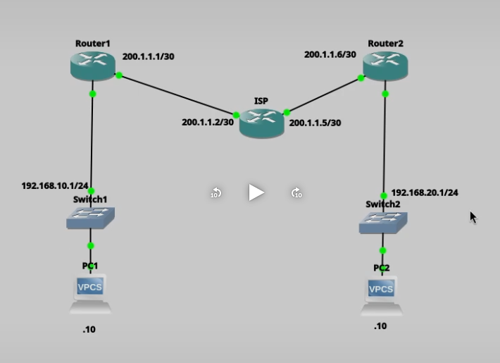
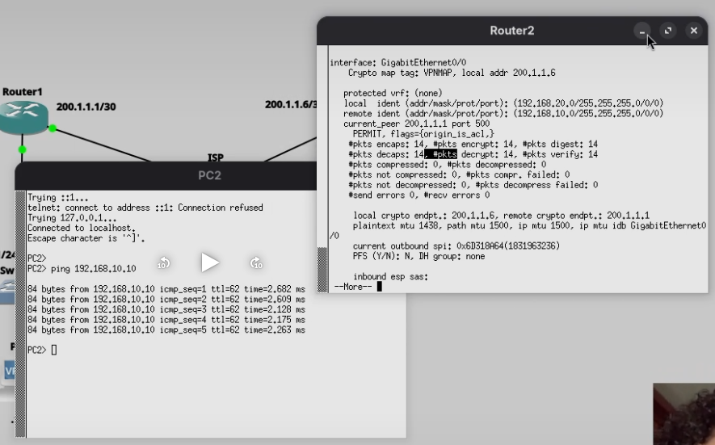

# VPN Site-to-Site Basada en Políticas (Policy-Based VPN)

**Alumno:** Alvaro Smilk Baez Tavera  
**Matrícula:** 20211150

---

# Objetivo

Implementar una VPN IPSec Site-to-Site basada en políticas (Policy-Based VPN) utilizando IKEv1 entre dos routers Cisco. La VPN permite establecer una comunicación segura entre dos redes LAN remotas mediante el cifrado y autenticación del tráfico que atraviesa una red pública.

---

# Topología


---

# Descripción de la topología

La infraestructura utilizada está conformada por:

- Router 1
- Router ISP
- Router 2
- Switch LAN 1
- Switch LAN 2
- PC1
- PC2

Los routers R1 y R2 establecen un túnel IPSec Site-to-Site a través del ISP para proteger el tráfico entre ambas redes locales.

---

# Direccionamiento IP

| Dispositivo | Interfaz | Dirección IP |
|-------------|----------|--------------|
| Router1 | G0/0 | 200.1.1.1/30 |
| Router1 | G0/1 | 192.168.10.1/24 |
| ISP | G0/0 | 200.1.1.2/30 |
| ISP | G0/1 | 200.1.1.5/30 |
| Router2 | G0/0 | 200.1.1.6/30 |
| Router2 | G0/1 | 192.168.20.1/24 |
| PC1 | NIC | 192.168.10.10/24 |
| PC2 | NIC | 192.168.20.10/24 |

---

# Parámetros utilizados

## IKE Fase 1

| Parámetro | Valor |
|-----------|-------|
| Versión | IKEv1 |
| Cifrado | AES |
| Hash | SHA |
| Autenticación | Pre-Shared Key |
| Grupo DH | 2 |
| Lifetime | 86400 segundos |

---

## IPSec Fase 2

| Parámetro | Valor |
|-----------|-------|
| Transform Set | VPN-SET |
| Cifrado | ESP-AES |
| Integridad | ESP-SHA-HMAC |
| Modo | Tunnel |

---

## Clave Compartida

```
cisco123
```

---

# Configuración del Router 1

```cisco
conf t

crypto isakmp policy 10
 encr aes
 hash sha
 authentication pre-share
 group 2
 lifetime 86400
exit

crypto isakmp key cisco123 address 200.1.1.6

crypto ipsec transform-set VPN-SET esp-aes esp-sha-hmac
 mode tunnel

access-list 110 permit ip 192.168.10.0 0.0.0.255 192.168.20.0 0.0.0.255

crypto map VPNMAP 10 ipsec-isakmp
 set peer 200.1.1.6
 set transform-set VPN-SET
 match address 110

interface GigabitEthernet0/0
 crypto map VPNMAP

end

write memory
```

### Explicación

En Router 1 se configuró la política ISAKMP para establecer la negociación IKEv1 utilizando cifrado AES y autenticación mediante clave precompartida. Posteriormente se creó el Transform Set IPSec, la lista de acceso para identificar el tráfico interesante y el Crypto Map que finalmente fue aplicado sobre la interfaz WAN.

---

# Configuración del Router 2

```cisco
conf t

crypto isakmp policy 10
 encr aes
 hash sha
 authentication pre-share
 group 2
 lifetime 86400
exit

crypto isakmp key cisco123 address 200.1.1.1

crypto ipsec transform-set VPN-SET esp-aes esp-sha-hmac
 mode tunnel

access-list 110 permit ip 192.168.20.0 0.0.0.255 192.168.10.0 0.0.0.255

crypto map VPNMAP 10 ipsec-isakmp
 set peer 200.1.1.1
 set transform-set VPN-SET
 match address 110

interface GigabitEthernet0/0
 crypto map VPNMAP

end

write memory
```

### Explicación

Router 2 fue configurado como el extremo remoto del túnel IPSec utilizando los mismos parámetros criptográficos que Router 1, modificando únicamente la dirección IP del peer remoto y la red local correspondiente.

---

# Configuración del Router ISP

El router ISP únicamente proporciona conectividad entre ambos routers mediante enlaces WAN.

```cisco
interface GigabitEthernet0/0
 ip address 200.1.1.2 255.255.255.252
 no shutdown

interface GigabitEthernet0/1
 ip address 200.1.1.5 255.255.255.252
 no shutdown
```

No participa en el proceso de cifrado ni autenticación de la VPN IPSec.

---

# Funcionamiento

Una vez completada la configuración, el tráfico entre las redes:

- 192.168.10.0/24
- 192.168.20.0/24

es encapsulado y protegido mediante IPSec, garantizando la confidencialidad e integridad de la información transmitida entre ambos sitios.

---

# Prueba de funcionamiento

Se realizaron pruebas de conectividad entre ambas redes locales utilizando el comando **ping**.

Desde la PC1 (192.168.10.10) se realizó un ping hacia la PC2 (192.168.20.10), obteniendo respuesta satisfactoria a través del túnel VPN.


---

# Resultado

Las pruebas demostraron que la VPN Site-to-Site basada en políticas fue implementada correctamente, permitiendo la comunicación segura entre ambas redes LAN a través de IPSec IKEv1.

---

# Conclusión

La implementación de una VPN IPSec basada en políticas permitió establecer una comunicación cifrada entre dos sedes remotas utilizando una infraestructura WAN simulada. Se verificó el funcionamiento mediante pruebas de conectividad exitosas entre ambas LAN, comprobando que el tráfico viaja de forma segura a través del túnel VPN.

---

# Evidencias

## Topología

La siguiente figura muestra la topología implementada para la VPN Site-to-Site basada en políticas.



---

## Prueba de conectividad

Se realizó una prueba de conectividad desde la PC1 hacia la PC2 para verificar el correcto funcionamiento del túnel IPSec.



---

# Video de la práctica

Como parte de los entregables, se realizó un video demostrativo donde se muestra:

- La topología implementada.
- La configuración de la VPN.
- La prueba de conectividad entre las redes LAN.
- La verificación del correcto funcionamiento del túnel IPSec.

**Enlace del video:**

https://youtu.be/NIcKg9zEqE0?si=EcgrtBftB_4z68Zz

---

# Autor

**Alvaro Baez Tavera**

Matrícula:

**20211150**

ITLA - Ciberseguridad
